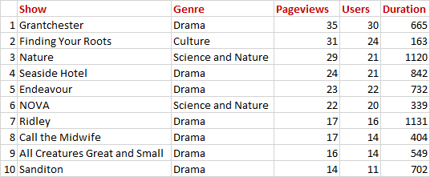

# KLRN Passport Referrals

This is an application to track PBS video referrals to KLRN's Passport donation page, which show up in Google Analytics 4 stats. KLRN Passport is a member benefit offering on-demand access to PBS shows.

Written in PHP to work with MySQL or MariaDB, this application replaces a [desktop python app](https://github.com/ptdriscoll/klrn-passport-referrals-database) that pulled and visualized similar data from Google Analytics 3.

Referrals are tracked through a "referrer=" query that PBS adds to donation-page links on their videos. The queries, reported in Google Analytics, show what web addresses clicks came from.

This app uses Google's [Analytics Data API](https://developers.google.com/analytics/devguides/reporting/data/v1) to pull the referrer stats, and PBS' [Media Manager API](https://docs.pbs.org/display/CDA/Media+Manager+API) to get information about the referring videos, and stores results in a database.



## Setup

### Enable the Analytics Data API

Google's [API Quickstart](https://developers.google.com/analytics/devguides/reporting/data/v1/quickstart-client-libraries) walks through creating a Cloud Platform project, enabling the analytics API, adding a service account, and adding the API user to a GA4 Analytics account.

In Step 1, after downloading the client configuration credentials, add the json file to the "auth" directory of this project ("auth/.gitignore" keeps files in "auth" out of the repository). In Step 3, the part about setting an environment variable is instead handled by this application.

Step 4 provides a link to a [PHP client library installation guide](https://github.com/googleapis/php-analytics-data#installation), which requires the dependency manager [Composer](https://getcomposer.org/). With Composer installed, since this project already includes a "composer.json" file, running `composer install` in a terminal from the project directory will add the client library.

### Get a Media Manager API key

PBS producers and stations can [get a key](https://digitalsupport.pbs.org/support/tickets/new) to access the Media Manager API.

### Create the database

Create a new database using a tool such as phpMyAdmin. Run "database/setup.sql" to create the tables. In phpMyAdmin, just copy the code into the window under the database's SQL tab, and click "Go".

### Set up config

Rename "config-example.php" to "config.php", move it to the "auth" directory ("auth/.gitignore" keeps files in "auth" out of the repository) and set the values.

`default_start_date` is how far back to get data - a Google Analytics 4 account must have been collecting stats since then.

`ga4_property_id` is the [Google Analytics 4 property ID](https://developers.google.com/analytics/devguides/reporting/data/v1/property-id).

`google_credentials_path` is where you put the client credentials json file from the Google Analytics Data API (see above).

`pbs_client_id` and `pbs_client_secret` come from the PBS Media Manager API key (see above).

`db_host`, `db_user`, `db_password` and `db_name` by default are set up for a database called `passport_referrals` on a localhost server, such as XAMPP, and should be changed to connect to the actual database being used.

### Run the app

A call to "run.php" (through a terminal or by visiting the page) will run the app to get data and store results in the database. The first call will get data going back to the default start date set in "auth/config.php".

Subsequent calls get the latest date saved in the database, rechecks that date (for any new analytics stats) and gets data up through the day before the current day.

Data collection can be automated by running a chron job once a day, say at noon (to give Google time to process the previous day's stats).

The chron job could invoke a shell script like this below, which can be called something like "chron.sh", and be placed in the same directory with "run.php" (make sure the directory and PHP paths match what's on the server):

```
#!/bin/bash
cd /home/<user>/<example.org>/<directory>
/usr/local/php81/bin/php run.php
```

Some queries to pull stats from the database are in "database/queries.sql".

### Hide files from public

The ".htaccess" file uses [mod_rewrite](https://httpd.apache.org/docs/current/rewrite/) to restrict public access to everything important except "run.php". Removing the hash (#) on the last line will hide "run.php" as well, which makes sense when relying on a terminal or chron job to call that page.

[Mod_rewrite can be avoided](https://httpd.apache.org/docs/current/rewrite/avoid.html) by instead configuring the server to set file restrictions.

## What's next

Future iterations will include a front end with interactive data visualizations.

## References

- [Google Analytics Data API](https://developers.google.com/analytics/devguides/reporting/data/v1)
- [GA4 Dimensions & Metrics Explorer](https://ga-dev-tools.google/ga4/dimensions-metrics-explorer/)
- [GA4 Query Explorer](https://ga-dev-tools.google/ga4/query-explorer/)
- [Google API Quickstart](https://developers.google.com/analytics/devguides/reporting/data/v1/quickstart-client-libraries)
- [Using OAuth 2.0 for Server to Server Applications](https://developers.google.com/identity/protocols/oauth2/service-account)
- [Google Analytics Data for PHP](https://github.com/googleapis/php-analytics-data#installation)
- [PBS Media Manager API](https://docs.pbs.org/display/CDA/Media+Manager+API)
- [PBS Media Manager Client](https://github.com/tamw-wnet/PBS_Media_Manager_Client)
